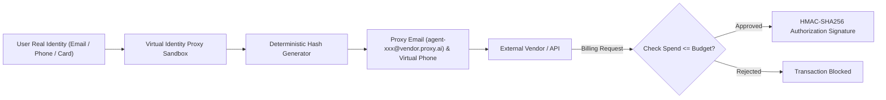

# genpark-agent-virtual-identity-proxy-sandbox-skill

> Ephemeral Virtual Identity & Credential Proxy Sandbox for Personal Agents. 100% Python Standard Library.

Distilled from architectural patterns pioneered by **szn**, where the personal assistant operates using its own dedicated proxy email, proxy phone, and virtual card credentials to isolate and safeguard the user's primary identity.

## Architecture

## Features
- **Zero Identity Leakage**: Primary user credentials remain completely hidden from external APIs and third-party vendors.
- **Granular Budget & Spending Limits**: Enforces hard budget bounds per vendor or task.
- **HMAC Signatures**: Every action performed on behalf of the user is cryptographically signed and non-repudiable.
